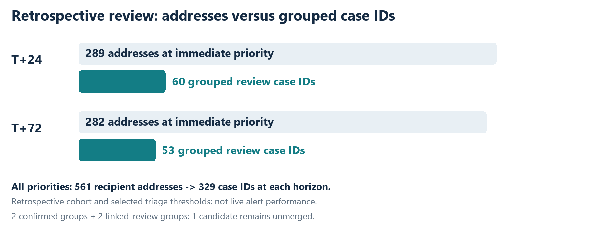
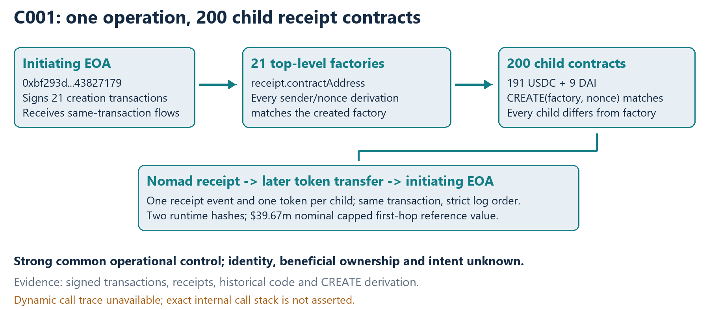

# Nomad Bridge | From on-chain evidence to investigation cases

**Retrospective analysis of the 2022 Nomad Bridge exploit.** The investigation turns transaction-level evidence into a traceable case queue, then challenges its own grouping and prioritization decisions against simpler alternatives.

## Investigation question

How should hundreds of receipt addresses be organized for review when shared infrastructure is visible on-chain, but common ownership is not? The analysis uses a pinned Nomad incident manifest, transaction logs, deterministic contract-creation checks, and a frozen decision policy. Each case retains the evidence behind its grouping and priority.

## Findings

| Measure | Result |
| --- | ---: |
| Receipt events in the pinned cohort | 1,175 |
| Recipient addresses | 561 |
| Review case IDs after grouping | 329 |
| Immediate-priority case IDs at T+24 / T+72 | 60 / 53 |

The largest structured case, **C001**, groups **200 recipient contracts** created through **21 top-level transactions** from **one initiating address**. Verified CREATE address derivations and same-transaction forwarding support a common deployment and execution pattern. The finding concerns transaction infrastructure; ownership and intent remain separate questions.

## From a receipt to a case

The [C001 evidence trail](EVIDENCE_SAMPLE.md) follows one Nomad receipt through its transaction's outbound log to a collector and documents the contract-creation checks used in grouping. The source transaction is linked so the chain of evidence can be inspected directly.

## Testing the decision, not just presenting it

The immediate tier is a declared review policy, not a fitted performance result. At equal case budgets, a simple gross-value ranking covers more gross receipt value than the policy queue at both cutoffs. One-change sensitivity tests leave **38 of 60** T+24 cases and **36 of 53** T+72 cases in the immediate tier throughout; the remaining boundary cases warrant closer review. These checks expose where the policy is robust and where its incremental value still needs an outcome-based test.

## Sources and scope

The cohort comes from [Nomad's public incident manifest](https://github.com/nomad-xyz/hack-data), curated retrospectively. Its last included receipt is timestamped **2022-08-02 00:05:49 UTC**. A separate [Coinbase incident analysis](https://www.coinbase.com/blog/nomad-bridge-incident-analysis) describes activity through **05:49 UTC**; the populations have not yet been reconciled. The findings therefore apply to the pinned cohort, not necessarily every transaction in the incident.

[Method, comparison results, and limitations](METHOD_AND_LIMITS.md) · [Worked transaction example](EVIDENCE_SAMPLE.md)

The full replay package and offline investigator interface are retained separately for technical diligence.

